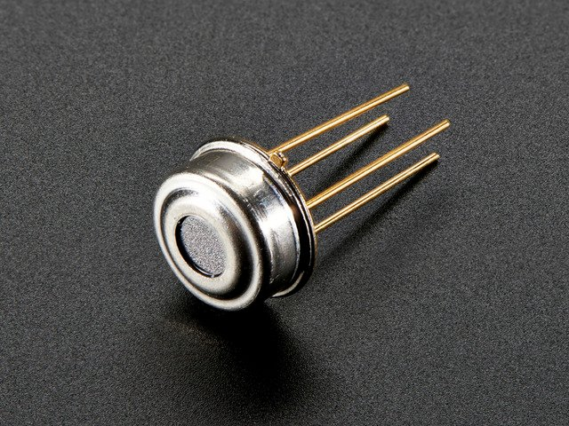
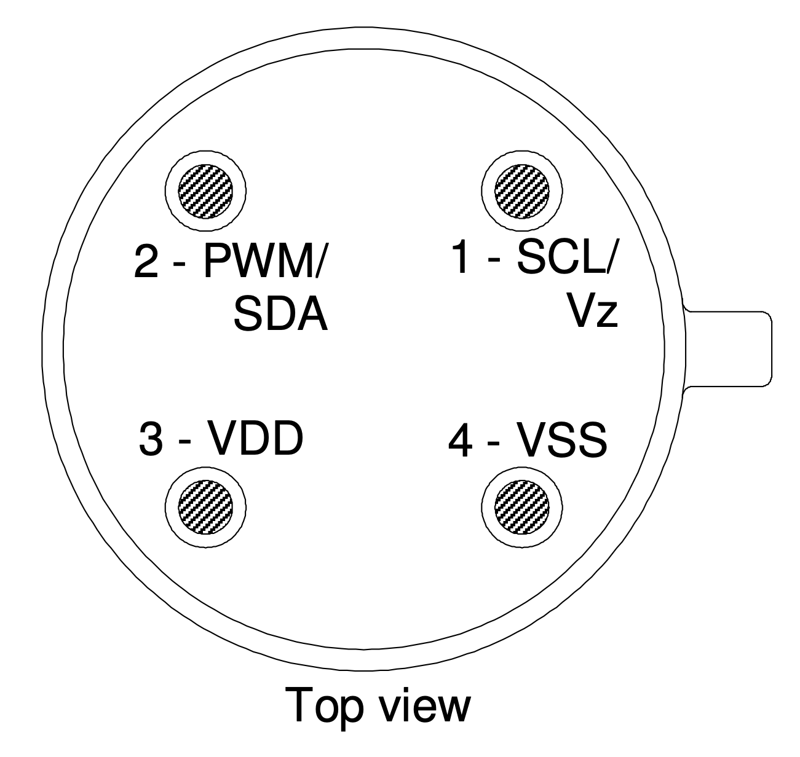
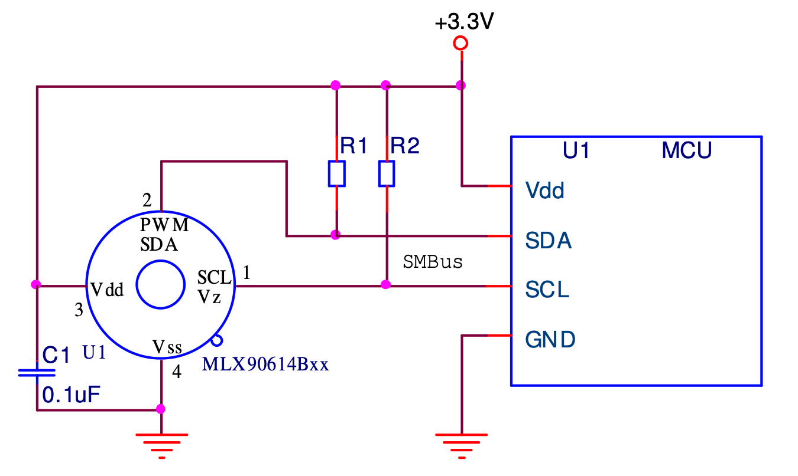
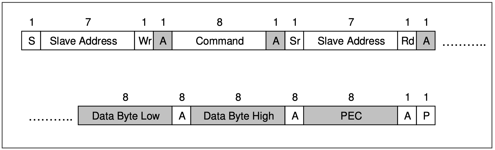
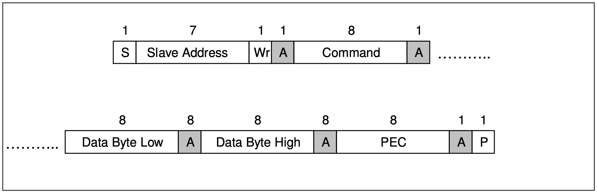
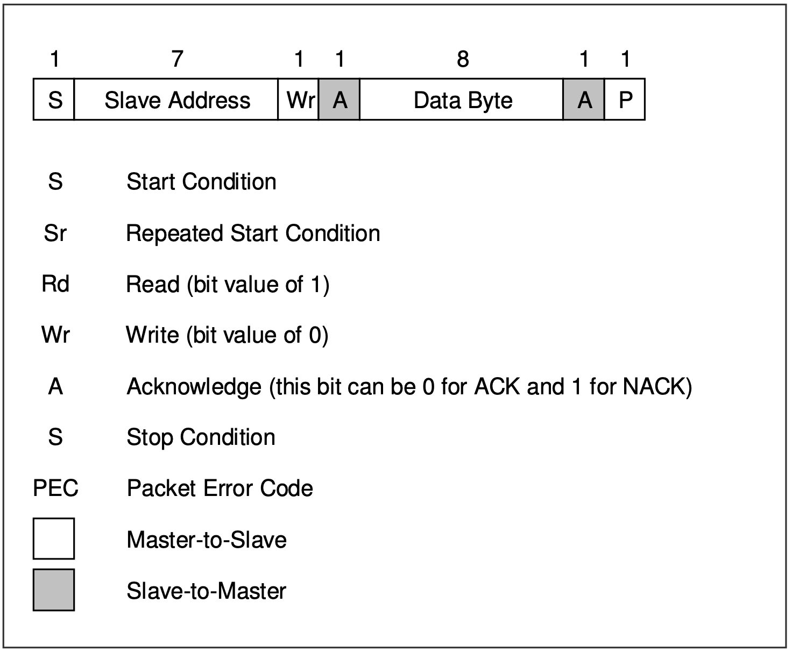

## CROSS PLATFORM, C DRIVER LIBRARY FOR MLX90614 CONTACTLESS TEMPERATURE
---


This library provides APIs that allow a mircocontroller to interact with MLX90614 contactless temperature sensor. 

<br/>

### MLX90614 contactless temperature sensor

*image courtsey - adafruit.com*

<br/>

### MLX90614 pinout

*image courtsey - MLX90614 datasheet*

<br/>

### MLX90614 Connection Diagram

*image courtsey - MLX90614 datasheet*

<br/>

### MLX90614 I2C reading and writing sequence
<br/>

**Reading Sequence**


*image courtsey - MLX90614 datasheet*

**Writing Sequence**


*image courtsey - MLX90614 datasheet*

**Legend**


*image courtsey - MLX90614 datasheet*

<br/>

## API reference for 'mlx90614_driver' library
---

```
char InitializeMLX(uint8_t addr)
```

This API is used to initialize the MLX90614 sensor.

**Parameters**

1. `uint8_t addr` : I2C address of the MLX90614. By default it is 0X5A however, it can be configured.

**Returns**

Type : `char`

`1` Success <br/>
`0` Failed

<br/>
<br/>

```
char MLXreadEmissivity(double * val)
```

This API is used to read the emissivity value.

**Parameters**

1. `double * val` : Pointer to variable where emissivity value will be stored after successful read. It ranges from 0.1 to 1.0

**Returns**

Type : `char`

`1` Success <br/>
`0` Failed

<br/>
<br/>

```
char MLXwriteEmissivity(double val)
```

This API is used to write the emissivity value.

**Parameters**

1. `double val` : The emissivity value to write to sensor

**Returns**

Type : `char`

`1` Success <br/>
`0` Failed

<br/>
<br/>

```
char MLXreadObjectTempF(double * temp)
```

This API is used to read object temperature in degrees fahrenheit.

**Parameters**

1. `double * temp` : Pointer to variable where temperature value will be stored.

**Returns**

Type : `char`

`1` Success <br/>
`0` Failed

<br/>
<br/>

```
char MLXreadAmbientTempF(double * temp)
```

This API is used to read ambient temperature in degrees fahrenheit.

**Parameters**

1. `double * temp` : Pointer to variable where temperature value will be stored.

**Returns**

Type : `char`

`1` Success <br/>
`0` Failed

<br/>
<br/>

```
char MLXreadObjectTempC(double * temp)
```

This API is used to read object temperature in degrees celsius.

**Parameters**

1. `double * temp` : Pointer to variable where temperature value will be stored.

**Returns**

Type : `char`

`1` Success <br/>
`0` Failed

<br/>
<br/>

```
char MLXreadAmbientTempC(double * temp)
```

This API is used to read ambient temperature in degrees celsius.

**Parameters**

1. `double * temp` : Pointer to variable where temperature value will be stored.

**Returns**

Type : `char`

`1` Success <br/>
`0` Failed

<br/>
<br/>

---